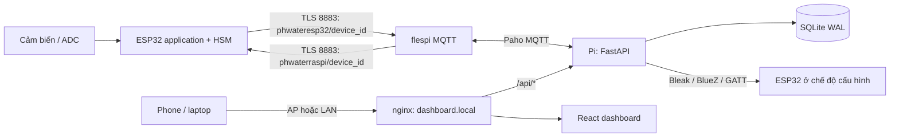

# pH Monitor — dashboard trên Raspberry Pi 4

Dashboard responsive cho điện thoại/laptop, nhận **dữ liệu thật** từ ESP32 qua flespi MQTT, lưu lịch sử trên Raspberry Pi và provision Wi-Fi ESP32 bằng BLE của Pi. Không còn dữ liệu demo hoặc fallback sang số đo giả.

**Hiện chưa hiệu chuẩn pH theo yêu cầu:** ESP32 gửi `ph: null`, `calibrated: false`, điện áp PO, ADC raw và mV đo thật. Dashboard vẽ điện áp; tab pH hiển thị trạng thái chưa có số đo. Không tự áp một công thức pH chưa hiệu chuẩn.

## Truy cập trạm đang triển khai

- Web: <http://dashboard.local/>; trong AP có thể dùng <http://dashboard.lan/> hoặc <http://10.42.0.1/>.
- LAN hiện tại: <http://192.168.1.16/>.
- Wi-Fi AP: `raspi-haianh`; Pi giữ IP AP `10.42.0.1/24`, DHCP cấp `.20–.200`.
- Pi dùng Ethernet làm đường Internet. AP, nginx, mDNS và API tự chạy sau boot.
- Browser mở URL để xem web. Cấu hình này không triển khai captive portal tự bật browser của điện thoại.
- ESP32 đang dùng device ID `ictu_haianh001`. Mặc định gửi 10 giây/lần; có thể đổi trên web, giới hạn **1–86400 giây**. Giá trị được lưu vào NVS và giữ sau reboot.

## Công nghệ

| Phần | Công nghệ | Vai trò |
| --- | --- | --- |
| UI | React 19, TypeScript, Vite 7 | SPA, navigation, gọi API cùng origin |
| Giao diện | Tailwind CSS 4, CSS responsive, Radix Dialog, Lucide | Layout phone/laptop, dialog có focus/keyboard support |
| Biểu đồ | Recharts 3 | Điện áp/pH theo thời gian; 1 giờ, 24 giờ, 7 ngày |
| Font | Inter Variable đóng gói local | Hoạt động khi phone chỉ kết nối AP, không cần CDN |
| Backend Pi | Python, FastAPI, Uvicorn, một worker | REST API, tác vụ BLE, đọc/ghi SQLite |
| MQTT Pi | [Paho MQTT 2](https://eclipse.dev/paho/files/paho.mqtt.python/html/client.html) | Subscribe và publish qua TLS |
| BLE Pi | Bleak + BlueZ | Scan advertisement, kết nối GATT và ghi Wi-Fi |
| Lưu trữ | SQLite WAL | Lịch sử, thiết bị, cài đặt trạm, trace lệnh |
| Firmware | ESP-IDF 5.3, [ESP-MQTT](https://docs.espressif.com/projects/esp-idf/en/v5.3/esp32/api-reference/protocols/mqtt.html), FreeRTOS, HSM | Lấy ADC, gửi định kỳ, xử lý command table |
| Hosting | nginx, systemd, NetworkManager, dnsmasq, Avahi | Web/API local, AP và tên DNS/mDNS |



Token flespi được hardcode theo yêu cầu tại `backend/config.py` và `../src/01_application/hsm/mqtt/mqtt_config.h`. Browser chỉ gọi API Pi; token không được nhúng vào bundle JavaScript hoặc trả về trong API. Broker hiện là `mqtt.flespi.io:8883`, username là token, password không dùng. Cả Pi và ESP32 kiểm tra chứng chỉ CA; ESP32 đồng bộ thời gian SNTP trước khi bắt đầu TLS.

## Hai nhánh MQTT

| Hướng | Topic thực tế | Đăng ký ACL/subscribe |
| --- | --- | --- |
| ESP32 → Pi | `phwateresp32/ictu_haianh001` | Pi subscribe `phwateresp32/#` |
| Pi → ESP32 | `phwaterraspi/ictu_haianh001` | ESP32 subscribe chính topic của mình |

`#` chỉ xuất hiện trong filter/ACL, không dùng khi publish. Telemetry, ACK và LWT phân biệt bằng `type` trên cùng nhánh ESP32. Dùng QoS 1, `retain=false`; không retain command. Firmware bỏ qua command retained để tránh áp lại cấu hình cũ khi reconnect.

### Command table

| `cmd` | Field | Handler application | Kết quả |
| --- | --- | --- | --- |
| `get_status` | `command_id` tùy chọn | `handle_get_status()` | Đọc ADC mới, gửi telemetry ngay, rồi ACK |
| `set_cycle` | `cycle_seconds`: integer 1–86400 | `handle_set_cycle()` | Lưu NVS `device/mqtt_cycle`, cập nhật chu kỳ, ACK |

Ví dụ gửi thủ công, không cần `command_id`:

```json
{"cmd":"get_status"}
```

```json
{"cmd":"set_cycle","cycle_seconds":30}
```

Khi web gửi, Pi thêm ID và deadline UTC:

```json
{"cmd":"set_cycle","cycle_seconds":30,"command_id":"<uuid>","expires_at":1791120200}
```

`expires_at` là epoch giây, do Pi đặt bằng thời gian gửi + 15 giây. Command đã hết hạn sẽ nhận `command_expired` và không chạy handler. Khi gửi thủ công có thể bỏ field này.

ACK trên `phwateresp32/<device_id>`:

```json
{"type":"ack","device_id":"ictu_haianh001","cmd":"set_cycle","command_id":"<uuid>","ok":true,"cycle_seconds":30}
```

Lỗi trả `ok: false`, `error`, ví dụ `unknown_cmd`, `invalid_cycle_seconds`, `nvs_write_failed`, `command_expired`. Web chỉ báo thành công sau ACK đúng ID, device và command; timeout sau 15 giây. ACK muộn vẫn được ghi vào trace để phản ánh kết quả thực tế. Firmware cache ACK của 8 command gần nhất trong RAM để hạn chế thực hiện lại khi QoS 1 giao trùng; reset sẽ xóa cache này.

### Telemetry

```json
{
  "type": "telemetry",
  "device_id": "ictu_haianh001",
  "message_id": "<boot_id>:<sequence>",
  "timestamp": 1791120200,
  "uptime_seconds": 120,
  "cycle_seconds": 30,
  "status": "online",
  "calibrated": false,
  "ph": null,
  "voltage": 0.284,
  "raw_adc": 0,
  "adc_mv": 142,
  "sensor_error": null
}
```

`voltage` = điện áp chân ADC đã chuyển mV × gain cầu chia áp 2.0 hiện tại. `get_status` thêm `command_id` vào telemetry để trace phép đọc do lệnh. Khi đọc cảm biến lỗi, `voltage` là null và `sensor_error` chứa mã lỗi; vẫn báo trạng thái thiết bị. Online/offline dựa trên LWT và thời gian nhận cuối: quá `max(30 giây, 3 × cycle)` không có telemetry thì hiển thị offline.

## Tổ chức firmware để trace và mở rộng

```text
src/02_middleware/m_protocol/mqtt/
  m_mqtt.h/.c                  API transport generic: init/start/stop/subscribe/publish
src/01_application/hsm/mqtt/
  mqtt_config.h                Broker, token, topic, cycle mặc định
  mqtt_hsm.h/.c                HSM offline → connecting → online
                               command_table[], dispatch_command(), business handlers
src/01_application/app_main.c   Nối sự kiện Wi-Fi và MQTT vào application HSM
src/01_application/event/event.h Sự kiện START/STOP/CONNECTED/DISCONNECTED/COMMAND/TICK
```

Middleware lắp lại message MQTT phân mảnh, giới hạn payload 511 byte và topic 127 byte, chuyển callback về application. Nó không biết JSON, device ID, cycle hoặc NVS. Callback chỉ copy command vào queue 8 phần tử và post event; parse JSON/dispatch chạy trong `app_task`, không chạy business logic trên MQTT thread.

`dispatch_command()` duyệt `command_table[]` bằng một vòng `for`; thêm lệnh bằng cách viết handler và thêm một hàng. Sensor HSM trên ESP32 đọc ADC mỗi 2 giây. Chu kỳ MQTT độc lập; mỗi lần publish hoặc `get_status` application lấy một mẫu ADC mới. Log có `cmd`, `command_id`, kết quả và cycle để đối chiếu với bảng SQLite `commands`.

Firmware dùng tối ưu kích thước và phân vùng factory 1500K (trước đây 1 MB không đủ TLS + Wi-Fi + BLE + MQTT). Offset/vùng NVS và PHY giữ nguyên. Không có OTA trong phân vùng hiện tại.

## Database lưu như thế nào?

File thực tế: **`/var/lib/ph-monitor/history.sqlite3`** trên Pi, bên cạnh có `-wal`, `-shm` khi service chạy. Dữ liệu nằm ngoài thư mục release web/backend nên deploy không làm mất lịch sử. Một DB connection có khóa bảo vệ cho MQTT thread và HTTP threads; dùng WAL và transaction. Token và mật khẩu Wi-Fi provision không được lưu trong SQLite.

| Bảng | Dữ liệu |
| --- | --- |
| `devices` | ID, tên, MAC BLE nếu provision qua Pi, lần nhận cuối, cycle, điện áp/pH gần nhất, lỗi sensor, trạng thái |
| `readings` | ID tăng dần, device ID, message ID, thời gian ESP32, thời gian Pi nhận, điện áp, pH nullable, ADC raw/mV, lỗi |
| `commands` | Command ID, thiết bị, cmd, payload gửi, pending/applied/failed/timeout, thời điểm gửi/kết thúc, ACK và lỗi |
| `settings` | Tên trạm, ngưỡng pH thấp/cao, retention ngày |

- UNIQUE `(device_id, message_id)` chống lưu trùng QoS 1.
- Kiểm tra topic khớp device ID, timestamp và giá trị hữu hạn trước khi ghi. Retained telemetry không ghi vào lịch sử.
- Timestamp DB dùng epoch UTC giây. API số đo trả epoch mili giây; UI đổi sang múi giờ browser. CSV xuất ISO UTC.
- Biểu đồ lấy tối đa khoảng 300 điểm. Có ≤300 mẫu thì trả mẫu gốc; nhiều hơn thì chia khoảng thời gian và lấy trung bình. Bảng lịch sử/CSV luôn dùng mẫu gốc.
- Retention mặc định 30 ngày, chỉnh được 1–365 ngày. Dọn mỗi phút; giảm retention sẽ xóa số đo ngoài khoảng mới ngay khi lưu cài đặt.
- Backend restart giữ nguyên lịch sử, đánh dấu command đang pending là `failed/backend_restarted` vì không thể khẳng định đã thực hiện.
- Internet/broker gián đoạn: web local và lịch sử cũ vẫn mở được, số đo mới chỉ tới Pi khi đường MQTT hoạt động. ESP-MQTT outbox có giới hạn 16 KB; hệ thống hiện không có bộ nhớ offline dài hạn trên ESP32.

Backup nhất quán bằng Python SQLite backup API, ví dụ trên Pi:

```bash
sudo -u haianh /opt/ph-dashboard/venv/bin/python - <<'PY'
import sqlite3
source = sqlite3.connect('/var/lib/ph-monitor/history.sqlite3')
target = sqlite3.connect('/home/haianh/ph-history-backup.sqlite3')
source.backup(target)
target.close()
source.close()
PY
```

## Provision BLE thật

1. Giữ nút cấu hình GPIO15 trên ESP32 **5 giây** để vào provisioning. Thiết bị mới chưa có Wi-Fi tự vào chế độ này. Thiết bị đã cấu hình có timeout provisioning 5 phút.
2. Vào **Thiết bị → Quét BLE** trên web. Pi scan 6 giây, xác nhận service UUID thay vì chỉ dựa vào tên.
3. Chọn ESP32 tương thích, nhập tên hiển thị, SSID tối đa 32 byte, mật khẩu 8–63 byte của Wi-Fi 2.4 GHz có Internet.
4. Pi kết nối GATT, đọc device ID, ghi SSID rồi password. Firmware kiểm tra Wi-Fi và lưu vào NVS.
5. UI chỉ báo hoàn tất khi Pi nhận telemetry mới của đúng device ID sau lần gửi Wi-Fi. Nếu chưa có MQTT sau khoảng một phút thì báo lỗi; gửi Wi-Fi thành công không đồng nghĩa MQTT đã hoạt động.

| GATT | UUID |
| --- | --- |
| Service | `3f7c2e91-6a4b-4d8f-9c25-71b0e6a4d853` |
| Device ID (read) | `3f7c2e92-6a4b-4d8f-9c25-71b0e6a4d853` |
| SSID (write with response) | `3f7c2e93-6a4b-4d8f-9c25-71b0e6a4d853` |
| Password (write with response) | `3f7c2e94-6a4b-4d8f-9c25-71b0e6a4d853` |

BLE chạy trên Pi nên phone không cần Web Bluetooth/HTTPS. Đóng dialog chỉ dừng việc browser theo dõi tiến trình; tác vụ trên Pi vẫn tiếp tục và Wi-Fi đã ghi không được hoàn tác. Mật khẩu chỉ tồn tại trong request/tác vụ provision, không log hoặc trả về trong job.

## API

| Method | Endpoint | Nội dung |
| --- | --- | --- |
| GET | `/api/snapshot` | Thiết bị, cài đặt, kết nối MQTT, địa chỉ trạm |
| PUT | `/api/settings` | Lưu tên trạm/ngưỡng/retention vào SQLite |
| POST | `/api/devices/{id}/commands` | `{cmd, cycle_seconds?}`; trả command job |
| GET | `/api/commands/{id}` | Kết quả ACK hoặc timeout |
| GET | `/api/chart?device_id=&start=&end=` | Biểu đồ, epoch giây |
| GET | `/api/readings?device_id=&start=&end=&limit=20&offset=0` | Số đo gốc và tổng số bản ghi |
| GET | `/api/export.csv?device_id=&start=&end=` | CSV tất cả bản ghi trong khoảng |
| POST | `/api/ble/scan` | Tạo scan job |
| POST | `/api/ble/provision` | `{mac,name,ssid,password}`; tạo provision job |
| GET | `/api/ble/jobs/{id}` | Tiến trình/kết quả, không trả mật khẩu |

UI polling snapshot 2.5 giây; biểu đồ/bảng cập nhật khoảng 5 giây. `nginx` proxy API tới `127.0.0.1:8000`, static SPA được phục vụ tại port 80. Network/broker đang hiển thị cấu hình deployment hiện tại; form cài đặt web thay đổi tên trạm, ngưỡng và retention, không thay đổi NetworkManager hay token MQTT.

## Chạy và deploy

Dev UI dùng Vite proxy `/api` tới Pi đang chạy:

```bash
cd dashboard
npm ci
npm run dev
# http://localhost:5173 hoặc http://<IP máy dev>:5173
```

Deploy backend/UI lên Pi đã có nginx/AP/DNS:

```bash
# Từ thư mục repository
ssh haianh@192.168.1.16 'sudo apt-get install -y python3-venv'
bash dashboard/deploy/deploy-backend.sh haianh@192.168.1.16
bash dashboard/deploy/deploy-ui.sh haianh@192.168.1.16
```

Backend ở `/opt/ph-dashboard/backend`, virtualenv `/opt/ph-dashboard/venv`, systemd `ph-dashboard-api.service`. UI ở `/var/www/ph-dashboard/releases/<timestamp>`, symlink `current`. Python dependency ranges trong `backend/pyproject.toml`; npm lockfile cho frontend. Script không erase DB/NVS và giữ release UI trước đó.

Firmware dùng ESP-IDF local hiện có:

```bash
make build
make flash PORT=/dev/ttyUSB0 BAUD=115200
make monitor PORT=/dev/ttyUSB0
```

Kiểm tra vận hành:

```bash
ssh haianh@192.168.1.16 'systemctl is-active ph-dashboard-api nginx avahi-daemon dashboard-mdns'
ssh haianh@192.168.1.16 'journalctl -u ph-dashboard-api -f'
curl http://192.168.1.16/api/snapshot
```

DNS AP dùng `deploy/dashboard-dns.conf` (`/etc/NetworkManager/dnsmasq-shared.d/ph-dashboard.conf`); mDNS alias dùng `deploy/dashboard-mdns.py/.service`. Các file deployment DNS/AP mô tả cấu hình đã cài trước đó; deploy backend/UI không tự đổi AP.

## Kiểm thử

```bash
python3 -m unittest discover -s dashboard/backend -p 'test_*.py' -v
cd dashboard
npm run build
npm run lint
PLAYWRIGHT_CHROMIUM_EXECUTABLE=/usr/bin/google-chrome npm run test:e2e
```

Test database kiểm tra chống trùng, validation, ACK đúng thiết bị/lệnh, timeout/restart, retention và offline. Browser tests mock API chỉ trong test, kiểm tra command success/timeout, BLE form, lịch sử, settings, lỗi API và responsive 360/390/768/1440 px. Kiểm tra trên thiết bị thật đã nhận telemetry qua TLS, lưu DB, đổi cycle bằng web, gửi ngay và giữ cycle qua reboot ESP32. Scan BlueZ trên Pi đã chạy thật; provision GATT end-to-end cần ESP32 ở chế độ cấu hình để thao tác thực tế.
